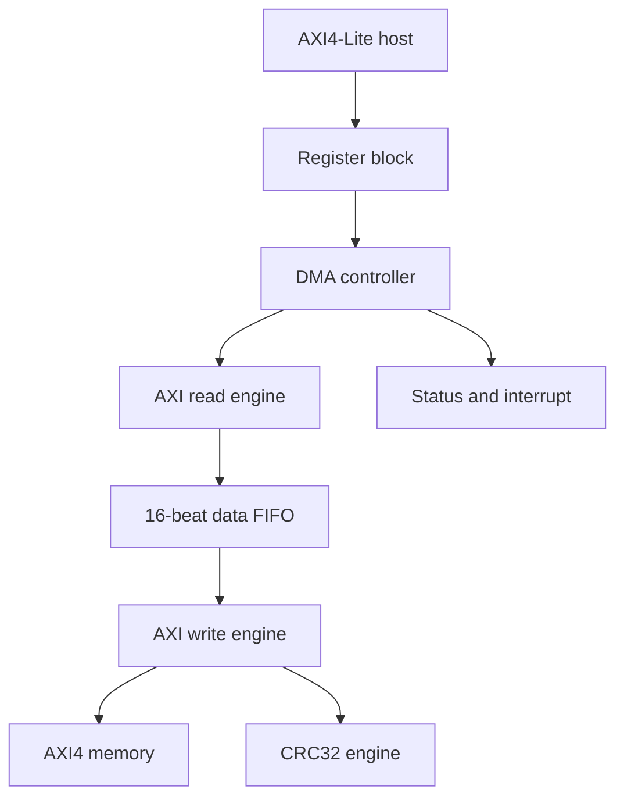
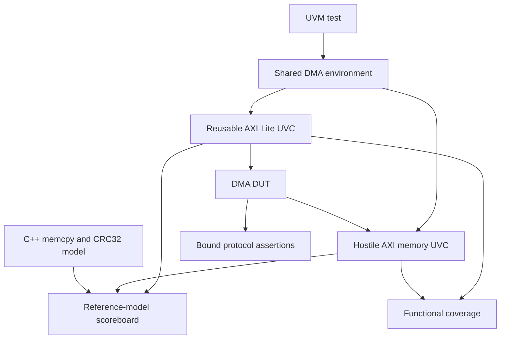

# VeriDMA

VeriDMA is a verification-first ASIC portfolio project built around a
synthesizable 64-bit AXI4 direct-memory-access engine. The RTL provides a
realistic protocol, buffering, boundary, error, reset, and progress-accounting
problem. The primary deliverable is the SystemVerilog/UVM verification platform:
reusable agents, constrained-random stimulus, a reference-model scoreboard,
functional coverage, protocol assertions, formal targets, and deterministic
regression triage.

No unmeasured coverage or performance result is claimed in this repository.
Generated reports are published only after they have been produced by the named
tool and reviewed with the accompanying waiver file.

## Architecture



The baseline executes one burst transaction at a time:

1. Validate and snapshot the programmed descriptor.
2. Plan a burst that fits the configured limit, FIFO capacity, remaining
   length, and both source and destination 4 KB boundaries.
3. Read the complete burst into the FIFO.
4. Write the burst and wait for `BRESP`.
5. Advance `BYTES_XFERRED` only after an `OKAY` write response.

This invariant gives abort and partial-progress behavior an exact meaning. An
abort is graceful at a burst boundary. An issued burst is completed, committed
progress is reported, and no AXI transaction is abandoned.

## Shipped baseline

| Capability | Status | Contract |
|---|---:|---|
| 64-bit AXI4 master | Implemented | INCR bursts, 8-byte beats, one ID |
| AXI4-Lite control | Implemented | Independent AW and W capture, byte strobes |
| Burst lengths | Implemented | 1, 2, 4, 8, or 16 beats |
| 4 KB splitting | Implemented | Applied independently to source and destination |
| Errors | Implemented | Read and write `SLVERR`, `DECERR`, protocol error |
| Illegal descriptors | Implemented | Zero length, unaligned, oversized, overlap rejected |
| Graceful abort | Implemented | Stops after the in-flight burst commits |
| Mid-transfer reset | Implemented | Asynchronous assertion, clean restart test |
| CRC32 | Implemented | Reflected CRC-32, checked by independent C++ model |
| Outstanding depth | Staged | Register retained; baseline intentionally executes one |
| Multiple IDs and reordering | Phase 2 | Not claimed by v1 |

The full interface contract is in [docs/axi_subset.md](docs/axi_subset.md), the
programming contract is in [docs/register_map.md](docs/register_map.md), and the
feature-to-check mapping is in [docs/testplan.md](docs/testplan.md).

## Verification architecture



All tests build the same `dma_env`. They alter memory latency, stalls, error
weights, and active/passive behavior through config objects. Factory overrides
select the hostile driver, forced-error response item, and boundary-biased
descriptor without editing the environment.

The scoreboard does not echo observed writes. At `START`, it snapshots source
memory, asks the C++ model for the expected destination and CRC, and preserves
guard regions. At termination it checks committed bytes, CRC, progress, and
out-of-window writes. Reports include descriptor, address, expected byte,
actual byte, test seed, and failing component.

## Repository map

```text
rtl/                 synthesizable register, controller, engines, FIFO and CRC
tb/uvc/axil/         standalone reusable AXI4-Lite UVC
tb/uvc/axi_mem/      hostile AXI memory slave and backing model
tb/env/              environment, scoreboard and coverage
tb/seq/              descriptor and control sequences
tb/tests/            directed and constrained-random tests
tb/sva/              assertions bound to the DUT
tb/reuse_demo/       unchanged AXI-Lite UVC used on a second DUT
formal/              register, FIFO and controller proof targets
model/               independent C++ reference model and DPI declaration
scripts/             regression, seed replay, triage and coverage merge
bugs/                real bug records and mutation campaign
docs/                architecture, test plan, closure log and execution plan
```

## Toolchain

- Vivado Simulator, UVM 1.2: primary constrained-random and coverage flow
- Verilator: synthesizable RTL lint
- SymbiYosys, Yosys, Boolector: bounded and invariant proofs
- GCC or Clang: DPI reference model
- Python 3 and Make: regression orchestration and triage

Vivado is intentionally not downloaded or redistributed. Set `XILINX_VIVADO`
and put `xvlog`, `xelab`, `xsim`, `xcrg`, and `export_xsim_coverage` in `PATH`.

## Running the project

```bash
make structure-check
make cpp-test
make script-test
make lint
make compile
make test TEST=dma_smoke_test SEED=992841
```

Regression and replay:

```bash
python3 scripts/run_regression.py --profile smoke --jobs 4
python3 scripts/run_regression.py --profile nightly --jobs 8
python3 scripts/triage.py --run results/<run-directory>
python3 scripts/rerun.py --run results/<run-directory> --seed 992841 --wave
```

Formal and coverage:

```bash
make formal
make coverage
```

`scripts/run_regression.py` generates deterministic seeds from the profile and
run index. Every run directory contains its immutable plan (`manifest.json`),
per-run logs, and a machine-readable summary with normalized failure buckets.

## Verification status policy

Implementation status is not closure status. A feature becomes **Closed** only
when its directed or random test passes, the intended coverpoint is hit, the
relevant assertion is non-vacuous, and the merged report is archived. Until
that happens, [docs/testplan.md](docs/testplan.md) leaves it **Implemented,
awaiting execution**.

Coverage history belongs in `coverage/history/`. Each snapshot must name the
seed count and the constraint, test, assertion, or waiver responsible for the
change. `docs/closure.md` records the narrative. No placeholder percentage is
included.

## Roadmap

- M0: UVM loop, reusable AXI-Lite UVC, DPI link, Make and CI
- M1: register block, readback semantics, first formal target
- M2: single-outstanding datapath, memory UVC, reference scoreboard
- M3: constrained-random descriptors, 4 KB splitting, coverage model
- M4: assertions, errors, abort, randomized reset and ordering
- M5: regression profiles, triage and deterministic replay
- M6: independent CRC32 comparison through DPI-C
- M7: mutation campaign, UVC reuse demonstration and closure report

The repository contains the implementation framework for M0 through M7. Final
coverage closure and mutation-detection figures must be generated on the target
xsim installation rather than fabricated in source control.

## License

MIT
